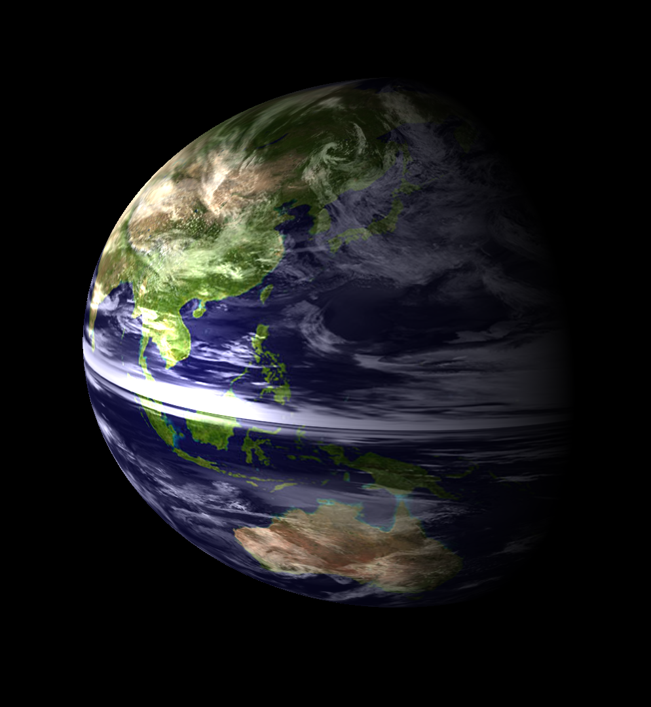
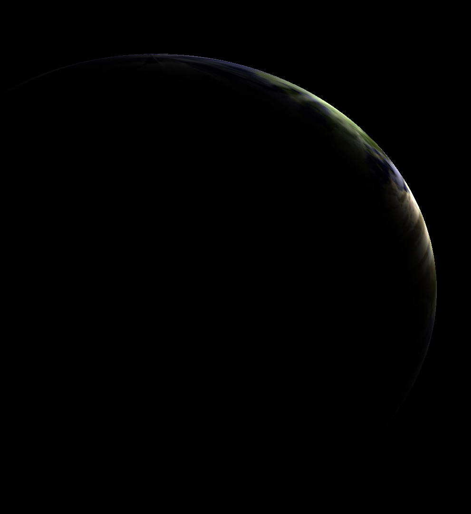
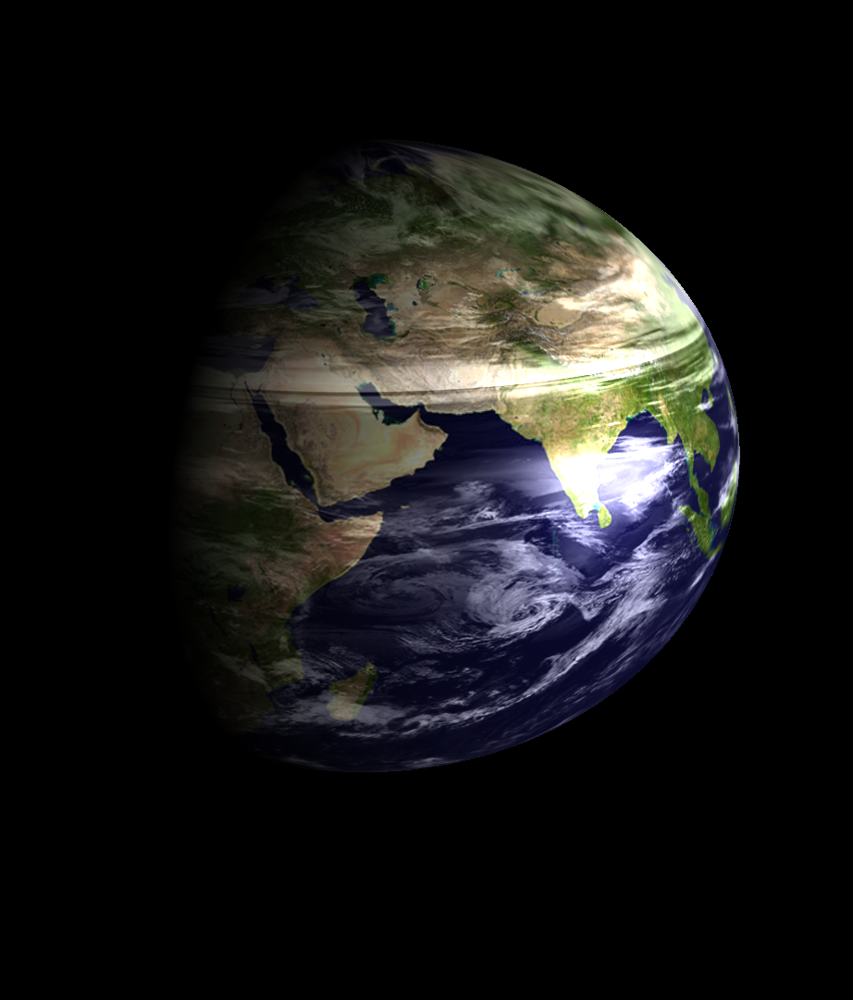

# BLUE MARBLE
### STUDY / COMPUTER GRAPHICS

Creation Date: 12/2022

 

# DESCRIPTION

This project is a study related to computer graphics, more specifically through C++ and OpenGL. The concepts behind this software start from topics like geometry, linear algebra, trigonometry until to technical aspects of OpenGL like working with matrices (ViewProjectionModel), create primitive models mathematically, controlling the rendering pipeline (through shaders), applying textures, programming a FPS camera, calculating light (Phong model), applying depth buffer and others.

 

# SCREENSHOTS

<table width="100%">
    <tr>
        <td>
            
        </td>
        <td>
            
        </td>
        <td>
            
        </td>         
    </tr>
</table>